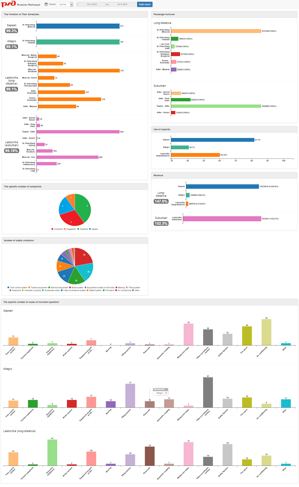

# Dashboard
This is an implementation of dashboard created with [D3.js](https://github.com/wout/svg.js)/[C3.js](https://github.com/jillix/svg.draggy.js). It's not meant to be a finished product, but just an example of how it might be. The data is just made up.



Feel free to edit / manipulate in any way you wish.

## Sources

This project makes use of several other projects:

 - [jQuery](https://github.com/jquery/jquery)
 - [Bootstrap](https://github.com/twbs/bootstrap)
 - [Datepicker for Bootstrap](https://github.com/eternicode/bootstrap-datepicker)
 - [D3.js](https://github.com/d3/d3)
 - [C3.js](https://github.com/c3js/c3)

```html
  console.log( "Ready!" );
```
